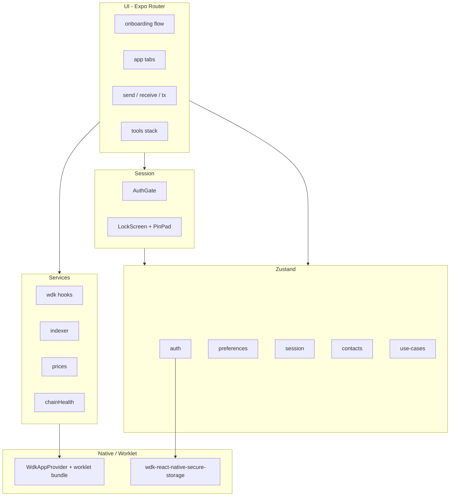

# Architecture

High-level map of Rune Wallet. The app is a thin React Native shell around the **Tether WDK** worklet engine.

## Runtime layers

## Routing

| Area | Path | Role |
|------|------|------|
| Sentinel | `src/app/index.tsx` | Routes to onboarding or `(app)` |
| Onboarding | `src/app/(onboarding)/` | Create/import wallet, PIN |
| Main tabs | `src/app/(app)/` | Wallet, portfolio, swap, history, settings |
| Modals | `send`, `receive/[chain]`, `tx/...` | Payments |
| Tools | `src/app/tools/` | Original use-case flows |

## Security boundaries

1. **Mnemonic / keys** — Only `@tetherto/wdk-react-native-secure-storage` and WDK worklet; never in Zustand or AsyncStorage.
2. **PIN** — SHA-256 hash in `expo-secure-store` via `src/store/auth.ts`.
3. **Auto-lock** — `AuthGate` + `session` store; background and inactivity timers.
4. **Seed screens** — `expo-screen-capture` prevention on recovery phrase UI.
5. **Lint** — Custom ESLint rules block logging sensitive identifiers.

## Rune Tools data

Envelopes, split bills, recurring templates, vault budgets, and watch-only entries are **local-only** JSON in SecureStore (`src/store/use-cases.ts`, `src/store/contacts.ts`). They are not synced on-chain.

## External dependencies

- **Balances / send** — WDK per-chain modules (EVM, TRON, TON).
- **History** — WDK Indexer API or public explorer APIs (see `src/services/indexer.ts`).
- **Fiat display** — CoinGecko or WDK prices API (`src/services/prices.ts`).

## Generated artifacts (not in git)

- `.wdk-bundle/wdk-worklet.bundle.js` — from `npx wdk-worklet-bundler generate`
- `ios/`, `android/` — from `npx expo prebuild` (gitignored)
